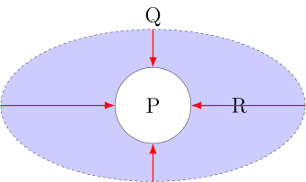
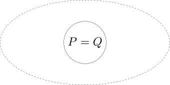

# Math memo
:sectnums:
:stem: latexmath
:toc:
:linkcss:

\( \def\b#1{\mathbf{#1}} \)
\( \def\ds{\displaystyle} \)
\( \def\txt#1{\ \textrm{#1} \ } \)

== if and only if

수학 영어 원서 책을 읽다 보면 _iff_ 라는 표현을 자주 접하게 되는데, 이 말은 __if and only
if__ 라는 말을 짧게 줄여서 쓴 표현이다.

=== 고등학교 학습 내용

이 표현의 의미를 설명하기에 앞서, 고등학교 때 배운 내용을 잠시 떠올려 보자. 우리는 다음의
두 수식은 같다고 배웠다.

[cols="2*^", options="header"]]
|===

| 수식
| 의미

| \( (P \to Q) \ \land \ (Q \to P) \) 
| if \(P\) then \(Q\) and if \(Q\) then \(P\)

| \( P = Q \)
| \(P\) is equal to \(Q\)

|===

즉, \( P \)가 \( Q \)의 필요 조건이자 충분 조건이면, \( P \) 와 \( Q \) 는 동치 관계라는
말이다.

이것을 다시 집합 기호를 빌려 표현하면, \( P \subset Q \) 이고, \( Q \subset P \) 이면, \(
P = Q \) 가 된다.

=== if and only if 의 의미

\( Q \txt{iff} P \) 는 \(Q\) if and only if \(P\) 와 같다고 이미 앞에서 이야기 했는데, 이
말은 결국 \( (P \to Q) \ \land \ (Q \to P) \) 와도 같은 표현이다. 어떻게 같게 되는지를
살펴 보자.

먼저 \(Q\) if and only if \(P\) 를 두 부분으로 나누어 보면 다음과 같이 된다.

[cols="2*^", options="header", width="70%"]
|===

| 의미
| 수식

| if \(P\) then \(Q\)   \( \quad (\leftarrow \)   \(Q\) if \(P)\)
| \( P \to Q \)

| only if \(P\) then \(Q\)   \( \quad (\leftarrow \)   \(Q\) only if \(P)\)
| \( Q \to P \)

|===

그런데 only if \(P\) then \(Q\) 부분이 어떻게 \( Q \to P \) 로 된다는 걸까? 직역하면
'오로지 \(P\)이면 \(Q\) 이다'가 되는데, 이것은 '\( P \to Q \)' 로 되는 것이 맞는 것이
아닌가 하는 생각이 들기 때문이다. 기존에는 이에 대한 설명이 없어서 내 나름대로 꽤
혼란스러웠던 기억이 나는데, 그 이유는 다음의 두 문장이 **등가**이기 때문이다.

* I cry, only if I'm sad. (나는 슬플 때에만 운다.)
+
(\(Q\) only if \(P\))

* If I cry, then I'm sad. (내가 울면 나는 슬프다.)
+
(\( Q \to P \))

=== 그림을 통한 이해

위의 예문을 아래의 그림을 통해 이해해 보자.

[cols="3*^", options="header"]]
|===

| (A)
| (B)
| pass:q[(C)]

| image:iff-1.svg[]
| 
.^| 

|===

* 그림 (A) 는 if \( P \) then \( Q \) 를 표시한다. 즉, \( P \) 는 슬픈 경우를, \( Q \) 는
  우는 경우를 표시한다. 그리고 보라색으로 표시된 \( R \) 부분은, 슬퍼서 우는 경우를 제외한
  모든 우는 경우, 즉 다시 말해서, 너무 기뻐서 울거나, 너무 아파서 울거나 또는 너무 분해서
  우는 경우 등등을 표시한다.

* 그림 (B) 는 only if \( P \) then \( Q \) 를 표시한다. 오로지 슬플 때에만 운다고
  함으로써, \( R \) 영역이 표시하고 있는 모든 경우를 \( Q \) 의 영역에서 배제하는 효과를
  가지게 된다. 결과적으로 \( Q \) 의 영역이 \( P \) 의 영역으로 축소되게 되는데, 이것을
  화살표로 표시하였다.

* 그림 pass:q[(C)] 는 최종적으로 \( P = Q \) 가 된 결과를 표시한다.

== 부분 집합(subset)의 종류

집합 \( A \) 의 원소의 개수가 \( n \) 개이면, 집합 \( A \) 의 부분 집합의 총 개수는 \( 2^n
\) 개이다. 예를 들어 집합 \( A = \{ 1, 2, 3 \} \) 일 때, 이 집합 \( A \) 의 부분 집합들을
전부 니열하면 다음과 같다.

\[ \emptyset, \{ 1 \}, \{ 2 \}, \{ 3 \}, \{ 1, 2 \}, \{ 1, 3 \}, \{ 2, 3 \},
   \{ 1, 2, 3 \} \]

위의 부분 집합들은 다시 크게 2 종류로 다음과 같이 나뉜다.

=== Proper subset (진부분 집합: 眞部分 集合)

진부분 집합은 위의 집합 \( A \) 의 부분 집합들 중에서 집합 \( A \) 자기 자신을 제외한
나머지 모든 부분 집합들로 다음과 같다.

\[ \emptyset, \{ 1 \}, \{ 2 \}, \{ 3 \}, \{ 1, 2 \}, \{ 1, 3 \}, \{ 2, 3 \} \]

여기서 진부분 집합(眞部分 集合)의, 진(眞) 자는 '참 진' 자이다. 우리가 상식적으로 생각하는
부분 집합은 자기 자신 전체를 포함하지 않는다고 생각하는 것이 일반적이므로, 그런 부분
집합들을 '진정한' 의미의 부분 집합이라고 여겨서 진부분 집합이라고 부르게 된 것이다.

집합 \( A \) 가 집합 \( B \) 의 진부분 집합일 때 표기법은 다음과 같다.

\[ A \subset B \]

=== Improper subset (비진부분 집합: 非眞部分 集合)

집합 \( A \) 의 모든 부분 집합들 중에서 진부분 집합들을 제외한 나머지 부분 집합이므로,
집합 \( A \) 자기 자신만을 가리킨다.

\[ \{ 1, 2, 3 \} \]

집합 \( A \) 가 집합 \( B \) 의 비진부분 집합일 때의 표기법은 다음과 같다.

\[ A \subseteq B \]

=== 결론

다시 말해 진부분 집합은, 자기 자신의 전체 집합을 제외한 모든 부분 집합을 일컫는 말이고,
비진부분 집합은 부분 집합들 중 진부분 집합들을 제외한, 자기 자신의 전체 집합만을 가리킨다.

따라서 \( n \) 개의 원소를 가진 집합 \( A \) 의 부분 집합의 개수는 다음과 같다.

* 집합 \( A \) 의 모든 부분 집합의 개수 = \( 2^n \) 개
* 집합 \( A \) 의 진부분 집합의 개수 = \( 2^n - 1 \) 개
* 집합 \( A \) 의 비진부분 집합의 개수 = \( 1 \) 개

== \( p \rightarrow q \)에서 \( p \)가 거짓이면, \( p \rightarrow q \)는 왜 항상 참이 되나요?

다음은 Facebook 수학 그룹에 올라온 위의 질문에 제가 참여한 내용의 일부를 발췌/편집한
내용이다. 기록과 인터넷에서의 검색을 위해 이곳에 정리해 둔다. 질의응답에 참여한 사람의 이름은 익명으로 처리하였다.

<A>::
\( p \rightarrow q \)에서 \( p \)가 거짓이면, \( p \rightarrow q \)는 왜 항상 참이 되나요?

<B>::
진리집합으로 생각하면 모든 공집합은 모든 집합의 부분집합이죠.

<본인>::
저도 <A>님과 같은 의문을 가진 사람으로서 질문을 던져 봅니다. 저는 이런 질문이 대단히 중요하다고 봅니다. 이해시키려는 노력 없이 무조건 암기하라고 하는 현재의 수학 풍토가 수포자를 양산한 이유들 중의 하나라고 보기 때문입니다. 저의 질문도 논박하기 위한 것이라기 보다는 이해를 더 잘하기 위한 과정으로 보아 주시기 바랍니다. 그리고 저의 생각에 문제가 있는 부분은 지적해 주시기 바랍니다.
+
김보민님의 답변에 따르면, '\( \sim\!p \)는 곧 공집합이다'라는 것으로 보이는데 그 근거가 무엇인가요?
+
예를 들어, '비가 오면 나는 막걸리를 마신다'는 명제가 있을 때
+
* (1) 비가 오면 나는 막걸리를 마신다.
* (2) 비가 오면 나는 막걸리를 마시지 않는다.
* (3) 비가 오지 않으면 나는 막걸리를 마신다.
* (4) 비가 오지 않으면 나는 막걸리를 마시지 않는다.
+
(1)은 당연히 참입니다.
+
(2)는 (1)의 전제에 위배되므로 당연히 거짓입니다.
+
(3)은 어떨까요? 비가 오면 막걸리를 마신다고 했지만, 나는 눈이 오거나 부부 싸움을 했을 때에도 막걸리를 마실 수 있으므로 이 명제를 거짓이라고 단언할 수 없다는 점에는 저도 동의합니다. 하지만 이 경우를 참이라고 단언할 수 있는 근거는 무엇인가요? 고등학교 수학 시간에 이 명제는   무조건 참이라고 배웠기 때문에 드는 의문입니다. 
+
(4)도 (3)의 경우와 마찬가지로 비가 오지 않을 때 나는 막거리를 마실 수도 있고, 마시지 않을 수도 있습니다. 그럼에도 이 경우도 무조건 참이라고 내리는 결론이 저는 이해가 되지 않습니다.
+
위의 경우를 예로 들었을 때, '비가 오지 않는다'라는 명제를 공집합으로 보기는 힘들다고 저는 봅니다. 눈이 오는 경우나 부부 싸움을 한 경우도 있다고 할 때 이것을 어떻게 공집합으로 취급할 수 있을까요?

<C>::
"비가 오지 않는다"라는 사실(집합)이 "비가 오면 나는 막걸리를 마신다"라는 명제가 참인 세계에 존재하지 않기(공집합) 때문입니다.

<본인>::
수학적으로 이해가 명확한, 양의 정수를 대상으로 하는 집합의 예를 들어 보겠습니다. 
+
[.text-center]
\( p \): 4의 배수이다. \( \qquad \) \( q \): 2의 배수이다.
+
\begin{align}
p \rightarrow q :&  \{4, 8, 12, ...\} \subset \{2, 4, 6, 8, ...\}  & \therefore 참 \\
p \rightarrow \sim\!q: {4, 8, 12, ...} ⊂ {1, 3, 5, 7, ...}  --> 거짓 \\

\end{align}

\sim\!p \rightarrow q: {1, 2, 3, 5, 6, 7, ...} ⊂ {2, 4, 6, 8, ...}  --> 거짓 \\
\sim\!p \rightarrow \sim\!q: {1, 2, 3, 5, 6, 7, ...} ⊂ {1, 3, 5, 7, ...} --> 거짓 \]
+
위의 예에서 오류가 있는 부분을 지적해 주시면 감사하겠습니다.

<박성호>
~p -> q가 거짓이면 제가 질문한 부분이랑 어긋나는거 아닌가요?

<김영태>
수학책에 나와 있는 것과 일치하지 않는다는 것을 보여주기 위해 제가 찾아낸 일종의 예로 보시기 바랍니다. 위에 손병호님께서 말씀하신대로 하면 다음과 같이 되어 성립하네요.

p -> q: {4, 8, 12, ...} ⊂ {2, 4, 6, 8, ...} --> 참
p -> ~q: {4, 8, 12, ...} ⊂ {1, 3, 5, 7, ...} --> 거짓

~p -> q: { } ⊂ {2, 4, 6, 8, ...} --> 참
~p -> ~q: { } ⊂ {1, 3, 5, 7, ...} --> 참

이런 질의응답 방식을 통해 이해에 도달하게 된 점에 감사드립니다! ^^

<박성호>
그런데 왜 공집합이 된 거죠?

<김영태>
위의 p -> q 이다라는 명제는 p의 집합과 q의 집합에 대해서만 서술하고 있습니다. ~p (p가 아닌 집합)에 대해서는 일언반구의 그 어떤 언급도 없습니다. 따라서 p ∩ ~p = { }이 되고, 집합 p의 세상을 '기준'으로 볼 때에 ~p 집합은 아예 존재하지 않은 것으로 취급되는 것 같습니다.

